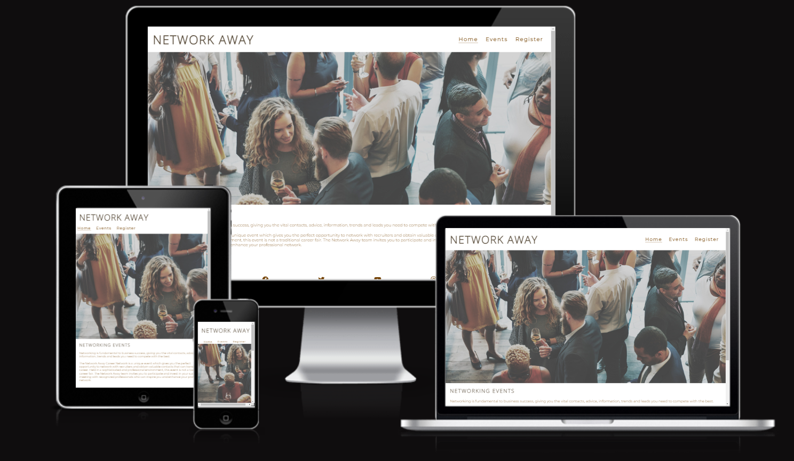
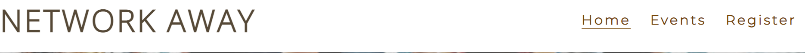
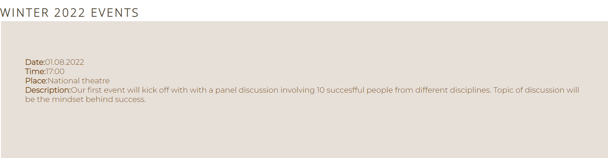
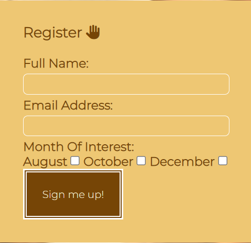
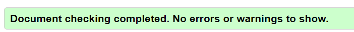
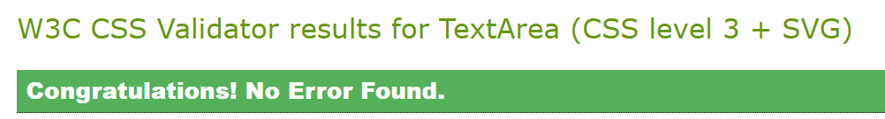
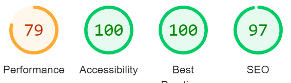

#### Network Away

The Network Away website is a networking events page, where Oslo residents interested in networking with like-minded people can visit to get information on event schedules,topic of event and register to participate.

## Features

### Navigation
Inludes the logo and the navigation links that link into their respective pages at the top of all 3 pages. The logo take us to the home page when clicked from other pages. Their value to user is that they make it accessible to move from one page to another seemlessly.

### Events

This page includes the events taking place in the nearest future, where it will take place and what it will focus on. The value of this to user is provision of information readliy that they may determine themselves the value of the event beforehand. 

### Register

This is a form for users to be able to enter their full name, email and get to check off which month they would like to participate. It's value for user is the ability to sign up to be able to participate in the events. 

### Testing

#### Code Validation

##### HTML
- No errors where found when running the project through official W3C validator
  

##### CSS
- No errors where found when running the project through official (jigsaw) validator
  

#### Manual Testing

- Navigation links -  are expected to take user to desired page with convenience. 
  - Tested the feature by clicking the different links from each page and they work as expected.
- Social media links - are expected to take user to the respective social media platform on a new tab. 
  - Tested the feature by clicking the different links from each page and they work as expected.
- Register form - is expected to take in user input of name and email and their choice of month they want to participate. In case a user forgets to either type in name or email address, the form is expected to raise a message informing the user to fill out required field. 
   - Tested the feature by typing in in all the required fields and the form completed sign up as   designed.
   Did a fault check testing also by leaving out the name and email address on different rounds and 
   the form raised the requirement message and did not go through the sign up request. 

#### Accessibility 
 -   

### Bugs
- Navigation Bugs 
   - If the user clicked the Register menu option while on the home page, it took the user to the Events page instead of the Register page.
      - This bug was due to linking the Events page to the Register menu option on navigation section. It was easily fixed by linking the correct page; Register file to the designated menu option. 

### Deployment
- The site was deployed to Github pages. The procedure of deployment was as follows:
   - Click on the settings tab of the project repository
   - Scroll down to pages tab on the left side of the screen under the category "Code and automation" 
   - Select the option main branch from the drop down menu of source
   - The link to the project website shortly will be provided. 
 

 ### Credits
  - The code to make the social media links was taken from CI running walkthrough project.
  - Photos were taken from Pexels.